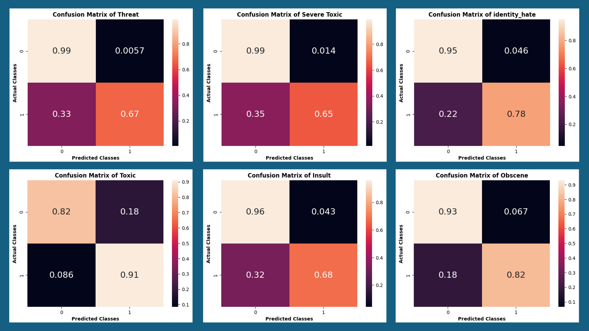
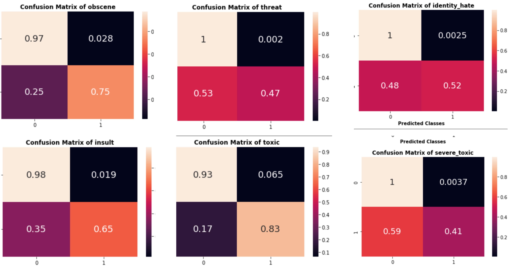

# Proposed Model & Results

## Proposed Model
- **Architecture:** BERT  
- **Epochs:** 5  
- **Learning Rate:** 3e-4  
- **Batch Size:** 64  
- **Optimizer:** Adam  

---

## Results

### With Weighted Sampling

### Without Weighted Sampling

